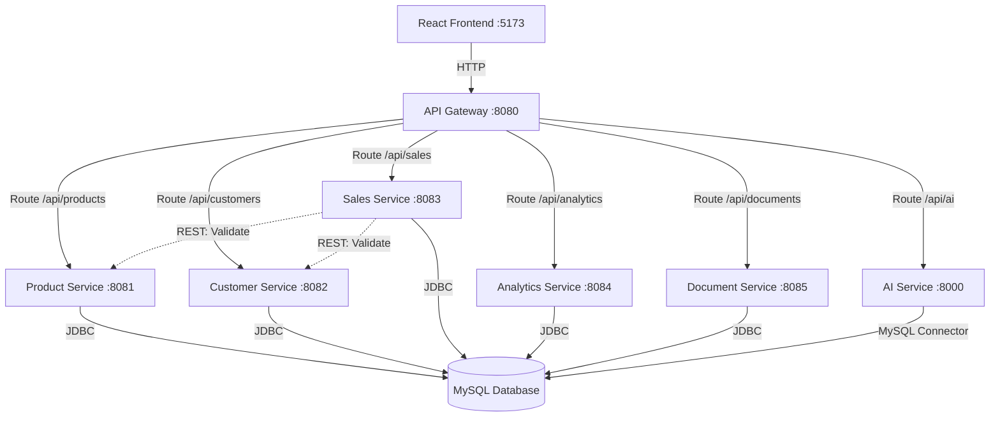
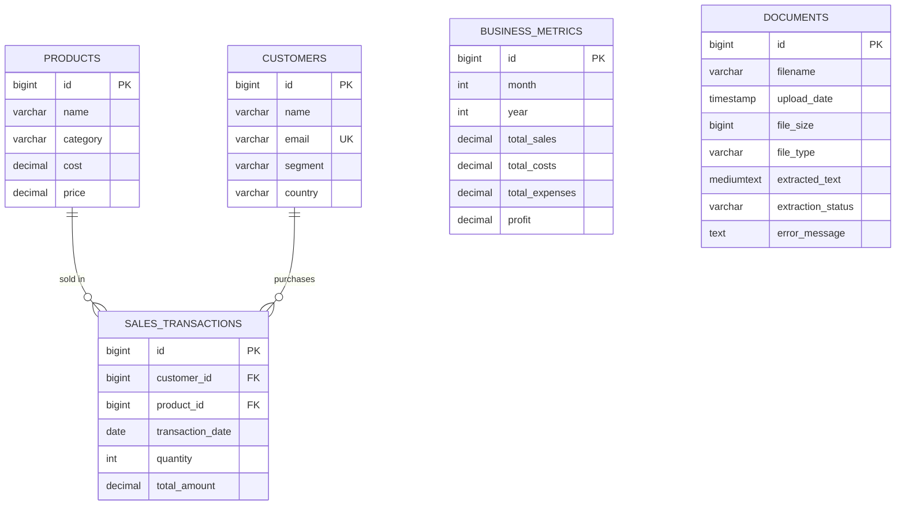

# Design Document: BusinessAI-Analytics Platform

## Overview

The BusinessAI-Analytics platform is a full-stack business intelligence system that combines microservices architecture, AI-powered forecasting, and conversational interfaces to provide comprehensive business data management and analytics capabilities.

### System Architecture

The system follows a microservices architecture pattern with the following key components:

- **Frontend Layer**: React TypeScript SPA (port 5173) providing user interface
- **API Gateway Layer**: Spring Cloud Gateway (port 8080) handling routing, load balancing, and cross-cutting concerns
- **Microservices Layer**: Five independent Spring Boot services managing distinct business domains
- **AI Service Layer**: Python FastAPI service (port 8000) providing ML-based forecasting and chatbot capabilities
- **Data Layer**: MySQL database shared across microservices

### Key Design Principles

1. **Domain-Driven Design**: Each microservice owns a specific business domain (Products, Customers, Sales, Analytics, Documents)
2. **Single Responsibility**: Services are independently deployable with clear boundaries
3. **Synchronous Communication**: REST-based inter-service communication for simplicity
4. **Shared Database**: All microservices connect to the same MySQL instance but manage their own domain tables
5. **Centralized Routing**: API Gateway provides single entry point for all client requests

### Technology Stack

**Backend Microservices:**
- Java 17
- Spring Boot 3.x
- Spring Cloud Gateway (API Gateway)
- Spring Data JPA (persistence)
- MySQL Connector

**AI Service:**
- Python 3.9+
- FastAPI (web framework)
- PyTorch (sales forecasting)
- TensorFlow (cost forecasting)
- MySQL Connector Python

**Frontend:**
- React 18
- TypeScript
- React Router (navigation)
- Axios (HTTP client)
- Chart.js or Recharts (visualization)

**Database:**
- MySQL 8.0

## Architecture

### Microservices Architecture

The backend is decomposed into five independent Spring Boot microservices coordinated by an API Gateway:



### API Gateway Design

The API Gateway uses Spring Cloud Gateway with route predicates and filters:

**Route Configuration:**
- `/api/products/**` → Product Service (8081)
- `/api/customers/**` → Customer Service (8082)
- `/api/sales/**` → Sales Service (8083)
- `/api/analytics/**` → Analytics Service (8084)
- `/api/documents/**` → Document Service (8085)
- `/api/ai/**` → AI Service (8000)

**Cross-Cutting Concerns:**
- Request logging
- Error handling and standardized error responses
- CORS configuration
- Request/response transformation

**Implementation Approach:**
The gateway uses Spring Cloud Gateway's declarative routing configuration with predicates for path matching and filters for request/response manipulation. Routes are defined in `application.yml` using the `spring.cloud.gateway.routes` configuration.

### Inter-Service Communication

**Sales Service Dependencies:**
The Sales Service validates customer and product references before creating transactions. This is implemented via synchronous REST calls:

1. Sales Service receives create transaction request
2. Sales Service calls Customer Service GET `/api/customers/{id}` to validate customer exists
3. Sales Service calls Product Service GET `/api/products/{id}` to validate product exists and retrieve price
4. If both validations pass, Sales Service calculates total amount and persists transaction
5. If validation fails, Sales Service returns 400 Bad Request

**Trade-offs:**
- **Synchronous REST**: Simple, easy to debug, but creates coupling and latency
- **Alternative considered**: Event-driven with message queue would reduce coupling but adds complexity for this local system
- **Decision**: Use synchronous REST for simplicity given local deployment and moderate scale

### AI Service Integration

The AI Service is implemented as a separate Python FastAPI application for the following reasons:

1. **Language Optimization**: Python ecosystem provides superior ML/AI libraries (PyTorch, TensorFlow, scikit-learn)
2. **Independent Scaling**: AI workloads have different resource requirements than CRUD operations
3. **Model Management**: Separate service simplifies model training, versioning, and deployment
4. **Technology Flexibility**: Allows using async Python for concurrent request handling

**Communication Pattern:**
- Frontend → API Gateway → AI Service (HTTP/REST)
- AI Service → MySQL Database (direct connection for data retrieval)

## Components and Interfaces

### Product Service (Port 8081)

**Responsibilities:**
- Manage product CRUD operations
- Validate product data
- Provide product lookup for other services

**REST Endpoints:**
- `POST /api/products` - Create product
- `GET /api/products/{id}` - Retrieve product by ID
- `GET /api/products` - List all products
- `PUT /api/products/{id}` - Update product
- `DELETE /api/products/{id}` - Delete product

**Key Classes:**
- `Product` (Entity): JPA entity with fields: id, name, category, cost, price
- `ProductRepository` (Repository): Spring Data JPA repository
- `ProductService` (Service): Business logic layer
- `ProductController` (Controller): REST endpoint handler

### Customer Service (Port 8082)

**Responsibilities:**
- Manage customer CRUD operations
- Validate customer data including email format
- Provide customer lookup for other services

**REST Endpoints:**
- `POST /api/customers` - Create customer
- `GET /api/customers/{id}` - Retrieve customer by ID
- `GET /api/customers` - List all customers
- `PUT /api/customers/{id}` - Update customer
- `DELETE /api/customers/{id}` - Delete customer

**Key Classes:**
- `Customer` (Entity): JPA entity with fields: id, name, email, segment, country
- `CustomerRepository` (Repository): Spring Data JPA repository
- `CustomerService` (Service): Business logic with email validation
- `CustomerController` (Controller): REST endpoint handler

### Sales Service (Port 8083)

**Responsibilities:**
- Record sales transactions
- Validate customer and product references
- Calculate transaction totals
- Provide sales data filtering by date, customer, product

**REST Endpoints:**
- `POST /api/sales` - Create sales transaction
- `GET /api/sales/{id}` - Retrieve transaction by ID
- `GET /api/sales` - List transactions with optional filters (dateFrom, dateTo, customerId, productId)

**Key Classes:**
- `SalesTransaction` (Entity): JPA entity with fields: id, customerId, productId, date, quantity, totalAmount
- `SalesRepository` (Repository): Spring Data JPA repository with custom query methods
- `SalesService` (Service): Business logic including validation and calculation
- `SalesController` (Controller): REST endpoint handler
- `ProductClient` (REST Client): Calls Product Service for validation
- `CustomerClient` (REST Client): Calls Customer Service for validation

**Validation Logic:**
```java
// Pseudo-code for transaction creation
public SalesTransaction createTransaction(SalesTransactionRequest request) {
    // Validate customer exists
    Customer customer = customerClient.getCustomer(request.getCustomerId());
    if (customer == null) throw new ValidationException("Customer not found");
    
    // Validate product exists and get price
    Product product = productClient.getProduct(request.getProductId());
    if (product == null) throw new ValidationException("Product not found");
    
    // Calculate total
    BigDecimal total = product.getPrice().multiply(new BigDecimal(request.getQuantity()));
    
    // Create and save transaction
    SalesTransaction transaction = new SalesTransaction();
    transaction.setCustomerId(request.getCustomerId());
    transaction.setProductId(request.getProductId());
    transaction.setDate(request.getDate());
    transaction.setQuantity(request.getQuantity());
    transaction.setTotalAmount(total);
    
    return salesRepository.save(transaction);
}
```

### Analytics Service (Port 8084)

**Responsibilities:**
- Manage business metrics CRUD operations
- Calculate profit from sales, costs, and expenses
- Aggregate sales transaction data into metrics
- Provide dashboard data endpoints

**REST Endpoints:**
- `POST /api/analytics/metrics` - Create business metric
- `GET /api/analytics/metrics` - List metrics with date range filter
- `GET /api/analytics/dashboard` - Get dashboard summary (totals, best/worst months, top products)
- `POST /api/analytics/aggregate` - Trigger aggregation of sales data into metrics

**Key Classes:**
- `BusinessMetric` (Entity): JPA entity with fields: id, month, year, totalSales, totalCosts, totalExpenses, profit
- `MetricsRepository` (Repository): Spring Data JPA repository with date range queries
- `AnalyticsService` (Service): Business logic for calculations and aggregations
- `AnalyticsController` (Controller): REST endpoint handler

**Aggregation Logic:**
The service can aggregate sales transaction data into monthly metrics:
1. Query all sales transactions for a given month
2. Sum total amounts to get monthly sales
3. Calculate costs based on product costs and quantities
4. Store as BusinessMetric record

### Document Service (Port 8085)

**Responsibilities:**
- Handle document uploads
- Validate file formats (TXT, DOCX, PDF, XLSX)
- Extract text content from documents
- Store document metadata and extracted text

**REST Endpoints:**
- `POST /api/documents/upload` - Upload document (multipart/form-data)
- `GET /api/documents/{id}` - Retrieve document metadata
- `GET /api/documents` - List all documents
- `GET /api/documents/{id}/content` - Retrieve extracted text content
- `DELETE /api/documents/{id}` - Delete document

**Key Classes:**
- `Document` (Entity): JPA entity with fields: id, filename, uploadDate, fileSize, fileType, extractedText, extractionStatus, errorMessage
- `DocumentRepository` (Repository): Spring Data JPA repository
- `DocumentService` (Service): Business logic for upload and extraction
- `DocumentController` (Controller): REST endpoint handler
- `TextExtractor` (Component): Text extraction logic using Apache libraries

**Text Extraction Implementation:**

The service uses the following libraries:
- **Apache POI**: For DOCX and XLSX extraction
- **Apache PDFBox**: For PDF text extraction
- **Plain Java I/O**: For TXT files

```java
// Pseudo-code for text extraction
public String extractText(MultipartFile file, String fileType) {
    switch (fileType) {
        case "TXT":
            return new String(file.getBytes(), StandardCharsets.UTF_8);
        
        case "DOCX":
            XWPFDocument doc = new XWPFDocument(file.getInputStream());
            XWPFWordExtractor extractor = new XWPFWordExtractor(doc);
            return extractor.getText();
        
        case "PDF":
            PDDocument document = PDDocument.load(file.getInputStream());
            PDFTextStripper stripper = new PDFTextStripper();
            String text = stripper.getText(document);
            document.close();
            return text;
        
        case "XLSX":
            XSSFWorkbook workbook = new XSSFWorkbook(file.getInputStream());
            StringBuilder sb = new StringBuilder();
            for (Sheet sheet : workbook) {
                for (Row row : sheet) {
                    for (Cell cell : row) {
                        sb.append(cell.toString()).append(" ");
                    }
                    sb.append("\n");
                }
            }
            return sb.toString();
        
        default:
            throw new UnsupportedFileTypeException(fileType);
    }
}
```

**Error Handling:**
If text extraction fails, the service stores the error message in the `errorMessage` field and sets `extractionStatus` to "FAILED". The document metadata is still persisted to allow retry or manual intervention.

### AI Service (Port 8000)

**Responsibilities:**
- Train and serve sales forecasting models (PyTorch LSTM)
- Train and serve cost forecasting models (TensorFlow LSTM)
- Calculate profit forecasts
- Process chatbot queries
- Query database for chatbot responses
- Search document text for chatbot responses

**REST Endpoints:**
- `POST /api/ai/forecast/sales` - Generate 12-month sales forecast
- `POST /api/ai/forecast/costs` - Generate 12-month cost forecast
- `POST /api/ai/forecast/profit` - Generate 12-month profit forecast
- `POST /api/ai/chatbot/query` - Process natural language question
- `POST /api/ai/train` - Trigger model training (admin endpoint)

**Key Components:**

**1. Sales Forecasting Model (PyTorch)**
- Architecture: LSTM with 2 hidden layers (64 units each)
- Input: Historical monthly sales data (minimum 24 months)
- Output: 12 monthly predictions
- Training: 80/20 train/validation split, MSE loss, Adam optimizer
- Evaluation: Mean Absolute Percentage Error (MAPE) < 20%

```python
# Pseudo-code for PyTorch LSTM model
class SalesForecastModel(nn.Module):
    def __init__(self, input_size=1, hidden_size=64, num_layers=2, output_size=1):
        super().__init__()
        self.lstm = nn.LSTM(input_size, hidden_size, num_layers, batch_first=True)
        self.fc = nn.Linear(hidden_size, output_size)
    
    def forward(self, x):
        lstm_out, _ = self.lstm(x)
        predictions = self.fc(lstm_out[:, -1, :])
        return predictions
```

**2. Cost Forecasting Model (TensorFlow)**
- Architecture: LSTM with 2 hidden layers (64 units each)
- Input: Historical monthly cost data (minimum 24 months)
- Output: 12 monthly predictions
- Training: 80/20 train/validation split, MSE loss, Adam optimizer
- Evaluation: Mean Absolute Percentage Error (MAPE) < 20%

```python
# Pseudo-code for TensorFlow LSTM model
def build_cost_model(sequence_length):
    model = tf.keras.Sequential([
        tf.keras.layers.LSTM(64, return_sequences=True, input_shape=(sequence_length, 1)),
        tf.keras.layers.LSTM(64),
        tf.keras.layers.Dense(1)
    ])
    model.compile(optimizer='adam', loss='mse', metrics=['mae'])
    return model
```

**3. Profit Forecasting**
- Calculation: profit[month] = sales_forecast[month] - cost_forecast[month]
- No separate model training required
- Returns 12 monthly predictions

**4. Chatbot Query Processor**

The chatbot uses a rule-based approach to determine query intent and retrieve relevant data:

```python
# Pseudo-code for chatbot query processing
async def process_query(question: str) -> ChatbotResponse:
    # Determine intent using keyword matching
    intent = classify_intent(question)
    
    if intent == "sales_metrics":
        # Query database for sales data
        data = await query_sales_metrics()
        response = format_sales_response(data, question)
    
    elif intent == "product_info":
        # Query database for product data
        data = await query_products()
        response = format_product_response(data, question)
    
    elif intent == "customer_info":
        # Query database for customer data
        data = await query_customers()
        response = format_customer_response(data, question)
    
    elif intent == "document_search":
        # Search document text
        results = await search_documents(question)
        response = format_document_response(results, question)
    
    elif intent == "mixed":
        # Combine database and document search
        db_data = await query_database(question)
        doc_results = await search_documents(question)
        response = format_mixed_response(db_data, doc_results, question)
    
    else:
        response = "I'm not sure how to answer that question."
    
    return ChatbotResponse(question=question, answer=response)
```

**Intent Classification:**
Uses keyword matching and pattern recognition:
- "sales", "revenue", "total sales" → sales_metrics
- "product", "item", "inventory" → product_info
- "customer", "client", "segment" → customer_info
- "document", "file", "uploaded" → document_search
- Multiple keywords → mixed

**Document Search:**
- Extracts keywords from question
- Searches extracted text using SQL LIKE or full-text search
- Ranks results by keyword frequency
- Returns top 3 relevant excerpts with source filenames

**Database Queries:**
The AI Service connects directly to MySQL to retrieve data for chatbot responses. This avoids the latency of calling back through the API Gateway and microservices.

### Frontend Application (Port 5173)

**Responsibilities:**
- Provide user interface for all features
- Handle routing and navigation
- Display data visualizations
- Manage form inputs and validations
- Display error messages

**Pages/Routes:**
- `/` - Dashboard (metrics, charts, summaries)
- `/forecasts` - Forecasting page (sales, cost, profit charts)
- `/documents` - Document management (upload, list)
- `/chatbot` - Chatbot interface (conversation history)
- `/products` - Product management (CRUD)
- `/customers` - Customer management (CRUD)
- `/sales` - Sales transaction management (create, list)

**Key Components:**

**1. Dashboard Component**
- Displays total sales, costs, profit for selected period
- Shows best/worst performing months
- Lists top 5 products by revenue
- Renders line charts for sales, cost, profit trends
- Allows date range filtering

**2. Forecast Component**
- Triggers forecast generation via API calls
- Displays three line charts (sales, cost, profit)
- Shows historical data alongside predictions
- Distinguishes historical vs predicted data visually

**3. Document Upload Component**
- File input with format validation (TXT, DOCX, PDF, XLSX)
- Upload progress indicator
- Document list with metadata
- Error display for failed uploads

**4. Chatbot Component**
- Text input for questions
- Conversation history display
- Message bubbles for user/bot messages
- Loading indicator during processing
- Error handling for failed queries

**5. CRUD Components**
- Product form (name, category, cost, price)
- Customer form (name, email, segment, country)
- Sales transaction form (customer select, product select, date, quantity)
- Data tables with edit/delete actions

**State Management:**
Uses React hooks (useState, useEffect) for local state management. No global state library needed given moderate complexity.

**HTTP Client:**
Axios configured with base URL pointing to API Gateway (http://localhost:8080)

**Visualization Library:**
Recharts for line charts and bar charts (React-friendly, declarative API)

## Data Models

### Database Schema

```sql
-- Products table
CREATE TABLE products (
    id BIGINT AUTO_INCREMENT PRIMARY KEY,
    name VARCHAR(255) NOT NULL,
    category VARCHAR(100) NOT NULL,
    cost DECIMAL(10, 2) NOT NULL,
    price DECIMAL(10, 2) NOT NULL,
    created_at TIMESTAMP DEFAULT CURRENT_TIMESTAMP,
    updated_at TIMESTAMP DEFAULT CURRENT_TIMESTAMP ON UPDATE CURRENT_TIMESTAMP
);

-- Customers table
CREATE TABLE customers (
    id BIGINT AUTO_INCREMENT PRIMARY KEY,
    name VARCHAR(255) NOT NULL,
    email VARCHAR(255) NOT NULL UNIQUE,
    segment VARCHAR(100) NOT NULL,
    country VARCHAR(100) NOT NULL,
    created_at TIMESTAMP DEFAULT CURRENT_TIMESTAMP,
    updated_at TIMESTAMP DEFAULT CURRENT_TIMESTAMP ON UPDATE CURRENT_TIMESTAMP
);

-- Sales transactions table
CREATE TABLE sales_transactions (
    id BIGINT AUTO_INCREMENT PRIMARY KEY,
    customer_id BIGINT NOT NULL,
    product_id BIGINT NOT NULL,
    transaction_date DATE NOT NULL,
    quantity INT NOT NULL,
    total_amount DECIMAL(10, 2) NOT NULL,
    created_at TIMESTAMP DEFAULT CURRENT_TIMESTAMP,
    FOREIGN KEY (customer_id) REFERENCES customers(id) ON DELETE RESTRICT,
    FOREIGN KEY (product_id) REFERENCES products(id) ON DELETE RESTRICT,
    INDEX idx_transaction_date (transaction_date),
    INDEX idx_customer_id (customer_id),
    INDEX idx_product_id (product_id)
);

-- Business metrics table
CREATE TABLE business_metrics (
    id BIGINT AUTO_INCREMENT PRIMARY KEY,
    month INT NOT NULL,
    year INT NOT NULL,
    total_sales DECIMAL(12, 2) NOT NULL,
    total_costs DECIMAL(12, 2) NOT NULL,
    total_expenses DECIMAL(12, 2) NOT NULL,
    profit DECIMAL(12, 2) NOT NULL,
    created_at TIMESTAMP DEFAULT CURRENT_TIMESTAMP,
    updated_at TIMESTAMP DEFAULT CURRENT_TIMESTAMP ON UPDATE CURRENT_TIMESTAMP,
    UNIQUE KEY unique_month_year (month, year),
    INDEX idx_year_month (year, month)
);

-- Documents table
CREATE TABLE documents (
    id BIGINT AUTO_INCREMENT PRIMARY KEY,
    filename VARCHAR(255) NOT NULL,
    upload_date TIMESTAMP DEFAULT CURRENT_TIMESTAMP,
    file_size BIGINT NOT NULL,
    file_type VARCHAR(10) NOT NULL,
    extracted_text MEDIUMTEXT,
    extraction_status VARCHAR(20) NOT NULL DEFAULT 'PENDING',
    error_message TEXT,
    INDEX idx_file_type (file_type),
    INDEX idx_extraction_status (extraction_status),
    FULLTEXT INDEX idx_extracted_text (extracted_text)
);
```

### Entity Relationships



### JPA Entity Mappings

**Product Entity:**
```java
@Entity
@Table(name = "products")
public class Product {
    @Id
    @GeneratedValue(strategy = GenerationType.IDENTITY)
    private Long id;
    
    @Column(nullable = false)
    private String name;
    
    @Column(nullable = false)
    private String category;
    
    @Column(nullable = false, precision = 10, scale = 2)
    private BigDecimal cost;
    
    @Column(nullable = false, precision = 10, scale = 2)
    private BigDecimal price;
    
    @Column(name = "created_at", updatable = false)
    private LocalDateTime createdAt;
    
    @Column(name = "updated_at")
    private LocalDateTime updatedAt;
    
    // Getters, setters, constructors
}
```

**Customer Entity:**
```java
@Entity
@Table(name = "customers")
public class Customer {
    @Id
    @GeneratedValue(strategy = GenerationType.IDENTITY)
    private Long id;
    
    @Column(nullable = false)
    private String name;
    
    @Column(nullable = false, unique = true)
    @Email
    private String email;
    
    @Column(nullable = false)
    private String segment;
    
    @Column(nullable = false)
    private String country;
    
    @Column(name = "created_at", updatable = false)
    private LocalDateTime createdAt;
    
    @Column(name = "updated_at")
    private LocalDateTime updatedAt;
    
    // Getters, setters, constructors
}
```

**SalesTransaction Entity:**
```java
@Entity
@Table(name = "sales_transactions")
public class SalesTransaction {
    @Id
    @GeneratedValue(strategy = GenerationType.IDENTITY)
    private Long id;
    
    @Column(name = "customer_id", nullable = false)
    private Long customerId;
    
    @Column(name = "product_id", nullable = false)
    private Long productId;
    
    @Column(name = "transaction_date", nullable = false)
    private LocalDate transactionDate;
    
    @Column(nullable = false)
    private Integer quantity;
    
    @Column(name = "total_amount", nullable = false, precision = 10, scale = 2)
    private BigDecimal totalAmount;
    
    @Column(name = "created_at", updatable = false)
    private LocalDateTime createdAt;
    
    // Getters, setters, constructors
}
```

**BusinessMetric Entity:**
```java
@Entity
@Table(name = "business_metrics")
public class BusinessMetric {
    @Id
    @GeneratedValue(strategy = GenerationType.IDENTITY)
    private Long id;
    
    @Column(nullable = false)
    private Integer month;
    
    @Column(nullable = false)
    private Integer year;
    
    @Column(name = "total_sales", nullable = false, precision = 12, scale = 2)
    private BigDecimal totalSales;
    
    @Column(name = "total_costs", nullable = false, precision = 12, scale = 2)
    private BigDecimal totalCosts;
    
    @Column(name = "total_expenses", nullable = false, precision = 12, scale = 2)
    private BigDecimal totalExpenses;
    
    @Column(nullable = false, precision = 12, scale = 2)
    private BigDecimal profit;
    
    @Column(name = "created_at", updatable = false)
    private LocalDateTime createdAt;
    
    @Column(name = "updated_at")
    private LocalDateTime updatedAt;
    
    // Getters, setters, constructors
}
```

**Document Entity:**
```java
@Entity
@Table(name = "documents")
public class Document {
    @Id
    @GeneratedValue(strategy = GenerationType.IDENTITY)
    private Long id;
    
    @Column(nullable = false)
    private String filename;
    
    @Column(name = "upload_date", nullable = false)
    private LocalDateTime uploadDate;
    
    @Column(name = "file_size", nullable = false)
    private Long fileSize;
    
    @Column(name = "file_type", nullable = false)
    private String fileType;
    
    @Column(name = "extracted_text", columnDefinition = "MEDIUMTEXT")
    private String extractedText;
    
    @Column(name = "extraction_status", nullable = false)
    @Enumerated(EnumType.STRING)
    private ExtractionStatus extractionStatus;
    
    @Column(name = "error_message", columnDefinition = "TEXT")
    private String errorMessage;
    
    // Getters, setters, constructors
}

enum ExtractionStatus {
    PENDING, SUCCESS, FAILED
}
```

### API Request/Response Models

**CreateProductRequest:**
```json
{
  "name": "Laptop",
  "category": "Electronics",
  "cost": 800.00,
  "price": 1200.00
}
```

**CreateCustomerRequest:**
```json
{
  "name": "John Doe",
  "email": "john.doe@example.com",
  "segment": "Enterprise",
  "country": "USA"
}
```

**CreateSalesTransactionRequest:**
```json
{
  "customerId": 1,
  "productId": 5,
  "transactionDate": "2024-01-15",
  "quantity": 2
}
```

**CreateBusinessMetricRequest:**
```json
{
  "month": 1,
  "year": 2024,
  "totalSales": 50000.00,
  "totalCosts": 30000.00,
  "totalExpenses": 10000.00
}
```

**ForecastResponse:**
```json
{
  "predictions": [
    {"month": "2024-02", "value": 52000.00},
    {"month": "2024-03", "value": 54000.00},
    ...
  ],
  "mape": 15.5
}
```

**ChatbotQueryRequest:**
```json
{
  "question": "What were the total sales in January 2024?"
}
```

**ChatbotQueryResponse:**
```json
{
  "question": "What were the total sales in January 2024?",
  "answer": "The total sales in January 2024 were $50,000.00.",
  "sources": ["database:business_metrics"],
  "processingTime": 1.2
}
```


## Correctness Properties

*A property is a characteristic or behavior that should hold true across all valid executions of a system—essentially, a formal statement about what the system should do. Properties serve as the bridge between human-readable specifications and machine-verifiable correctness guarantees.*

### Property 1: Product Validation Rejects Invalid Data

*For any* product creation request with missing or invalid required fields (name, category, cost, price), the Product Service SHALL reject the request and return a validation error.

**Validates: Requirements 1.2**

### Property 2: Product CRUD Round-Trip Preserves Data

*For any* valid product, creating the product, then retrieving it SHALL return data that matches the original product data. Similarly, creating a product, updating it with new valid data, then retrieving it SHALL return the updated data.

**Validates: Requirements 1.3, 1.4**

### Property 3: Customer Email Validation

*For any* customer creation request, the Customer Service SHALL accept customers with valid email formats (containing @ and domain) and reject customers with invalid email formats.

**Validates: Requirements 2.2**

### Property 4: Customer CRUD Round-Trip Preserves Data

*For any* valid customer, creating the customer, then retrieving it SHALL return data that matches the original customer data. Similarly, creating a customer, updating it with new valid data, then retrieving it SHALL return the updated data.

**Validates: Requirements 2.3, 2.4**

### Property 5: Sales Transaction Reference Validation

*For any* sales transaction creation request, the Sales Service SHALL validate that the referenced customer ID and product ID exist in the database before creating the transaction. Transactions with non-existent references SHALL be rejected.

**Validates: Requirements 3.2**

### Property 6: Sales Transaction Total Calculation

*For any* sales transaction with quantity Q and product price P, the calculated total amount SHALL equal Q × P.

**Validates: Requirements 3.3**

### Property 7: Sales Transaction Filtering Correctness

*For any* sales transaction query with filters (date range, customer ID, or product ID), all returned transactions SHALL match the specified filter criteria.

**Validates: Requirements 3.5**

### Property 8: Business Metric Profit Calculation

*For any* business metric with total sales S, total costs C, and total expenses E, the calculated profit SHALL equal S - C - E.

**Validates: Requirements 4.2**

### Property 9: Business Metric Date Range Filtering

*For any* business metric query with a date range [start_month/year, end_month/year], all returned metrics SHALL have month/year values within the specified range (inclusive).

**Validates: Requirements 4.3**

### Property 10: Sales Aggregation Accuracy

*For any* set of sales transactions within a given month, aggregating them into a business metric SHALL produce a total sales value equal to the sum of all transaction amounts for that month.

**Validates: Requirements 4.4**

### Property 11: Dashboard Best and Worst Month Identification

*For any* set of business metrics, the identified best performing month SHALL have the maximum profit value, and the worst performing month SHALL have the minimum profit value among all metrics.

**Validates: Requirements 5.2**

### Property 12: Dashboard Top Products Ranking

*For any* set of products with associated sales transactions, the top 5 products by revenue SHALL be correctly sorted in descending order by total revenue, where revenue equals the sum of all transaction amounts for each product.

**Validates: Requirements 5.3**

### Property 13: Document Format Validation

*For any* document upload request, the Document Service SHALL accept files with extensions TXT, DOCX, PDF, or XLSX, and reject files with any other extension.

**Validates: Requirements 6.1, 6.2**

### Property 14: Document Metadata Preservation

*For any* uploaded document with filename F, file size S, and file type T, retrieving the document metadata SHALL return the same filename, file size, and file type values.

**Validates: Requirements 6.5**

### Property 15: Forecast Response Structure Completeness

*For any* forecast request (sales, cost, or profit), the response SHALL contain exactly 12 predictions, and each prediction SHALL have both a month field and a predicted value field.

**Validates: Requirements 8.4, 9.4, 10.3**

### Property 16: Profit Forecast Calculation

*For any* month M with sales forecast S[M] and cost forecast C[M], the profit forecast for month M SHALL equal S[M] - C[M].

**Validates: Requirements 10.1**

### Property 17: Chatbot Intent Classification Consistency

*For any* chatbot question containing specific domain keywords (e.g., "sales", "product", "customer", "document"), the AI Service SHALL classify the intent to match the keyword domain and route the query to the appropriate data source.

**Validates: Requirements 11.2**

### Property 18: Document Search Result Ranking

*For any* document search results with relevance scores, the results SHALL be ordered in descending order by relevance score (highest relevance first).

**Validates: Requirements 13.2**

### Property 19: Training Data Split Ratio

*For any* dataset with N records used for model training, splitting the data with an 80-20 ratio SHALL produce a training set with 0.8 × N records (rounded) and a validation set with 0.2 × N records (rounded).

**Validates: Requirements 15.5**

### Property 20: Foreign Key Constraint Enforcement

*For any* sales transaction creation attempt with a customer ID or product ID that does not exist in the respective tables, the database SHALL reject the insertion and enforce referential integrity.

**Validates: Requirements 16.2, 16.3**

### Property 21: Schema Script Idempotence

*For any* database state, running the schema creation script multiple times SHALL result in the same final schema without errors, regardless of whether tables already exist.

**Validates: Requirements 16.6**

### Property 22: API Gateway Status Code Correctness

*For any* API request through the gateway, the response SHALL return HTTP 200 for successful operations, HTTP 400 for validation errors, HTTP 404 for resource not found, and HTTP 500 for server errors, matching the error condition.

**Validates: Requirements 17.8**

## Error Handling

### Microservices Error Handling

**Validation Errors:**
- All services validate input data before processing
- Return HTTP 400 with descriptive error messages
- Include field-level validation details in response body

**Resource Not Found:**
- Return HTTP 404 when requested resource doesn't exist
- Include resource type and ID in error message

**Inter-Service Communication Errors:**
- Sales Service handles failures from Product/Customer service calls
- Retry logic with exponential backoff for transient failures
- Circuit breaker pattern to prevent cascade failures (optional enhancement)

**Database Errors:**
- Catch and log all database exceptions
- Return HTTP 500 with generic error message (hide internal details)
- Log full stack trace for debugging

**Error Response Format:**
```json
{
  "timestamp": "2024-01-15T10:30:00Z",
  "status": 400,
  "error": "Bad Request",
  "message": "Validation failed for product creation",
  "details": {
    "name": "Product name is required",
    "price": "Price must be greater than zero"
  },
  "path": "/api/products"
}
```

### AI Service Error Handling

**Model Loading Errors:**
- If pre-trained models don't exist, return HTTP 503 Service Unavailable
- Include message instructing to run training script first
- Log error with model file paths

**Insufficient Training Data:**
- Validate minimum 24 months of data before training
- Return HTTP 400 if insufficient data
- Include message specifying required data range

**Forecast Generation Errors:**
- Catch model inference exceptions
- Return HTTP 500 with generic error message
- Log full exception details including input data shape

**Chatbot Query Errors:**
- Handle database connection failures gracefully
- Return fallback response if query fails
- Log query and error details for debugging

**Database Query Timeouts:**
- Set query timeout to 3 seconds for chatbot queries
- Return partial results if available
- Include timeout warning in response

### Document Service Error Handling

**File Upload Errors:**
- Validate file size before processing (max 50MB)
- Return HTTP 413 Payload Too Large if exceeded
- Validate file format before extraction

**Text Extraction Errors:**
- Catch all extraction exceptions (POI, PDFBox)
- Store document with FAILED status and error message
- Return HTTP 200 with status indicating extraction failure
- Allow retry mechanism for failed extractions

**Unsupported File Format:**
- Return HTTP 400 with list of supported formats
- Include file extension in error message

### Frontend Error Handling

**API Request Failures:**
- Display toast notifications for errors
- Show specific error messages from API responses
- Provide retry button for transient failures

**Form Validation:**
- Client-side validation before submission
- Highlight invalid fields in red
- Display validation messages below fields

**Network Errors:**
- Detect offline state
- Display "No connection" message
- Queue requests for retry when connection restored

**Loading States:**
- Show loading spinners during API calls
- Disable submit buttons to prevent double submission
- Display progress bars for file uploads

## Testing Strategy

### Unit Testing

**Backend Microservices (JUnit 5 + Mockito):**
- Service layer unit tests with mocked repositories
- Controller unit tests with MockMvc
- Validation logic tests
- Calculation logic tests (profit, total amount)
- Test coverage target: 80% for service and controller layers

**AI Service (pytest):**
- Test intent classification logic with various question patterns
- Test profit calculation from sales and cost forecasts
- Test response formatting functions
- Mock database connections for unit tests
- Test coverage target: 75% for business logic

**Frontend (Jest + React Testing Library):**
- Component unit tests
- Form validation tests
- State management tests
- API client tests with mocked axios
- Test coverage target: 70% for components

### Property-Based Testing

**Testing Framework:**
- **Java**: Use [jqwik](https://jqwik.net/) for property-based testing in Spring Boot microservices
- **Python**: Use [Hypothesis](https://hypothesis.readthedocs.io/) for property-based testing in AI Service
- **Configuration**: Minimum 100 iterations per property test

**Property Test Implementation:**

Each correctness property defined in this document SHALL be implemented as a property-based test with the following tag format:

```java
// Java example with jqwik
@Property
@Tag("Feature: business-ai-analytics, Property 6: Sales Transaction Total Calculation")
void salesTransactionTotalCalculation(@ForAll @Positive int quantity, 
                                      @ForAll @Positive @BigRange(min = "0.01", max = "10000.00") BigDecimal price) {
    BigDecimal expectedTotal = price.multiply(new BigDecimal(quantity));
    BigDecimal actualTotal = salesService.calculateTotal(quantity, price);
    assertEquals(expectedTotal, actualTotal);
}
```

```python
# Python example with Hypothesis
@given(
    sales=st.lists(st.floats(min_value=0, max_value=1000000), min_size=12, max_size=12),
    costs=st.lists(st.floats(min_value=0, max_value=1000000), min_size=12, max_size=12)
)
@settings(max_examples=100)
def test_profit_forecast_calculation(sales, costs):
    """Feature: business-ai-analytics, Property 16: Profit Forecast Calculation"""
    profit = calculate_profit_forecast(sales, costs)
    for i in range(12):
        assert profit[i] == sales[i] - costs[i]
```

**Property Tests to Implement:**

1. **Product Service**: Properties 1, 2
2. **Customer Service**: Properties 3, 4
3. **Sales Service**: Properties 5, 6, 7
4. **Analytics Service**: Properties 8, 9, 10, 11, 12
5. **Document Service**: Properties 13, 14
6. **AI Service**: Properties 15, 16, 17, 18, 19
7. **Database Layer**: Properties 20, 21
8. **API Gateway**: Property 22

### Integration Testing

**Microservices Integration:**
- Test API Gateway routing to each microservice
- Test Sales Service calls to Product and Customer services
- Test database connectivity for all services
- Test end-to-end flows (create product → create customer → create transaction)
- Use TestContainers for MySQL in integration tests (optional)

**AI Service Integration:**
- Test model loading on service startup
- Test forecast generation with real database data
- Test chatbot queries with real database and documents
- Test document search functionality

**Document Extraction Integration:**
- Test text extraction for each file format (TXT, DOCX, PDF, XLSX)
- Use sample files for each format
- Verify extracted text content

**Frontend Integration:**
- Test API calls to backend through gateway
- Test form submissions and data display
- Test chart rendering with real data
- Use Mock Service Worker (MSW) for API mocking

### End-to-End Testing

**User Workflows (Cypress or Playwright):**
- Complete product management workflow
- Complete customer management workflow
- Create sales transaction workflow
- View dashboard and verify metrics
- Upload document and verify in list
- Generate forecasts and view charts
- Ask chatbot questions and verify responses

**Performance Testing:**
- Dashboard load time < 2 seconds
- Chatbot response time < 5 seconds
- Forecast generation time < 10 seconds
- Document upload and extraction time < 30 seconds for typical files

### Test Data Management

**Synthetic Data Generation:**
- Create seed script for generating test data
- 30 products across 5 categories
- 100 customers across 3 segments and 10 countries
- 5000 sales transactions over 5 years
- 60 business metrics (5 years monthly)
- Include realistic trends and seasonality

**Test Isolation:**
- Use separate test database for integration tests
- Clean database between test runs
- Use transactions with rollback for unit tests
- Generate fresh test data for each test suite run

### Model Testing

**Model Training Validation:**
- Verify MAPE < 20% on validation set
- Test with different data sizes (minimum 24 months)
- Verify model files are saved correctly
- Test model loading from saved files

**Model Inference Testing:**
- Test forecast generation with various input data
- Verify output shape (12 predictions)
- Test with edge cases (all zeros, very large values)
- Verify predictions are reasonable (not NaN or infinite)

**Note on Property-Based Testing Applicability:**

This system is primarily composed of CRUD operations, microservices infrastructure, UI rendering, and ML model training/inference. Most of these components are better tested with integration tests and example-based unit tests rather than property-based tests. However, the business logic calculations (profit, totals, aggregations), validation logic, and data transformations are well-suited for property-based testing and have been identified in the Correctness Properties section above.

The following areas are explicitly NOT suitable for property-based testing:
- Microservices routing and infrastructure wiring
- Document text extraction (external library behavior)
- ML model training and inference (non-deterministic)
- UI rendering and visualization
- Database schema creation
- File I/O operations

These areas will be covered by integration tests, example-based unit tests, and smoke tests as specified in the testing strategy.

